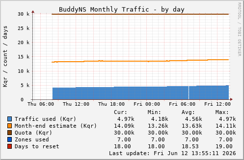

# munin-plugin-buddyns

Munin plugin for [BuddyNS](https://www.buddyns.com/) secondary DNS monitoring.

## Screenshot



## What it monitors

A single graph — **BuddyNS Monthly Traffic** — combining all relevant metrics:

| Data series | Colour | Description |
|---|---|---|
| Traffic used (Kqr) | blue area | DNS queries served this calendar month, in kilo-queries |
| Month-end estimate (Kqr) | orange line | BuddyNS projection of total traffic by end of month |
| Quota (Kqr) | dark orange line | Monthly traffic quota for the current plan |
| Zones used | blue line | Number of secondary zones delegated to BuddyNS |
| Days to reset | red line | Days remaining until the monthly counter resets |

Traffic resets at the start of each calendar month, producing a sawtooth pattern. The month-end estimate line lets you see early whether the current month is on track to exceed the quota. Zones and days share the same graph axis — their values (typically 1–100 for zones, 0–31 for days) are small relative to Kqr traffic but remain readable as reference lines.

BuddyNS API endpoints used: `/api/v2/zone/`, `/api/v2/service/`, `/api/v2/user/profile/`

## Requirements

- Perl 5
- `LWP::UserAgent` — Debian/Ubuntu: `libwww-perl`
- `JSON` — Debian/Ubuntu: `libjson-perl`

Both are standard packages almost certainly already installed on a Munin node.

## Installation

```bash
cp buddyns_ /usr/share/munin/plugins/
chmod 755   /usr/share/munin/plugins/buddyns_
ln -s /usr/share/munin/plugins/buddyns_ /etc/munin/plugins/buddyns_
```

## Configuration

Create `/etc/munin/plugin-conf.d/buddyns` with your BuddyNS credentials.

**API token** (preferred — from Account > API Key in the BuddyNS dashboard):

```ini
[buddyns_*]
env.apikey YOUR_API_TOKEN
```

**Username and password:**

```ini
[buddyns_*]
env.username you@example.com
env.password yourpassword
```

Then restart the Munin node:

```bash
systemctl restart munin-node
```

## Verifying the plugin

Check that the plugin is detected and configured correctly:

```bash
# Test autoconf (should print "yes")
munin-run buddyns_ autoconf

# Test config output
munin-run buddyns_ config

# Test data fetch
munin-run buddyns_
```

`munin-node-configure --suggest` will also list the plugin as available once credentials are in place.

## Developer reference

The plugin uses [BuddyNS API v2](https://www.buddyns.com/api/v2/). Endpoints consumed:

| Endpoint | Purpose |
|---|---|
| `GET /api/v2/zone/` | List active secondary zones (zone count) |
| `GET /api/v2/service/` | Plan details: zone limit, traffic quota |
| `GET /api/v2/user/profile/` | Usage: queries used and month-end estimate |

Authentication is either a token header (`Authorization: Token <key>`) or HTTP Basic auth.

## Nagios/Icinga companion

See `check_buddyns` in this repository for a Nagios/Icinga plugin covering the same metrics with WARNING/CRITICAL thresholds.

## Generated with

This code was generated with [Claude Code](https://claude.ai/code) (Sonnet 4.6).
